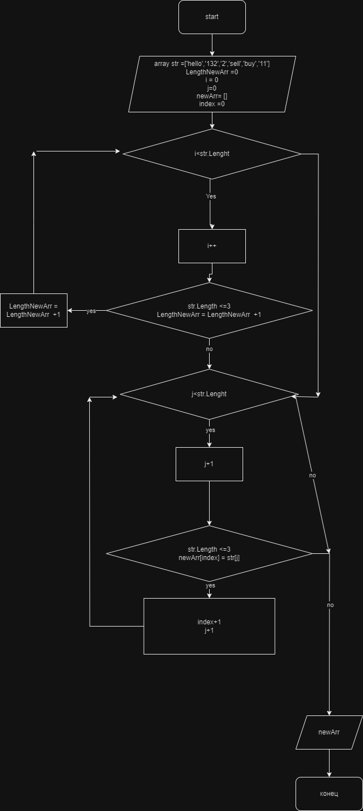

<!-- Задача: Написать программу, которая из имеющегося массива строк формирует новый массив из строк, длина которых меньше, либо равна 3 символам. Первоначальный массив можно ввести с клавиатуры, либо задать на старте выполнения алгоритма. При решении не рекомендуется пользоваться коллекциями, лучше обойтись исключительно массивами.

Примеры:
[“Hello”, “2”, “world”, “:-)”] → [“2”, “:-)”]
[“1234”, “1567”, “-2”, “computer science”] → [“-2”]
[“Russia”, “Denmark”, “Kazan”] → [] -->

# текстовое описание решения

1. Создаем массив строк str с исходными данными.
2. Выводим на экран исходный массив с помощью метода ShowArr.
3. Вычисляем количество элементов, удовлетворяющих условию (длина строки не больше 3 символов) в цикле с помощью переменной lengthSortArr.
4. Создаем новый массив resultArr с длиной lengthSortArr.
5. Объявляем переменную index и инициализируем ее значением 0.
6. В цикле пробегаемся по исходному массиву str, и если длина строки элемента не больше 3 символов, копируем его в новый массив resultArr с использованием переменной index. Затем увеличиваем index на 1.
7. Возвращаем новый массив resultArr из метода ArrSort.
8. Выводим на экран отсортированный массив с помощью метода ShowArr.

## Блок схема решения задачи

